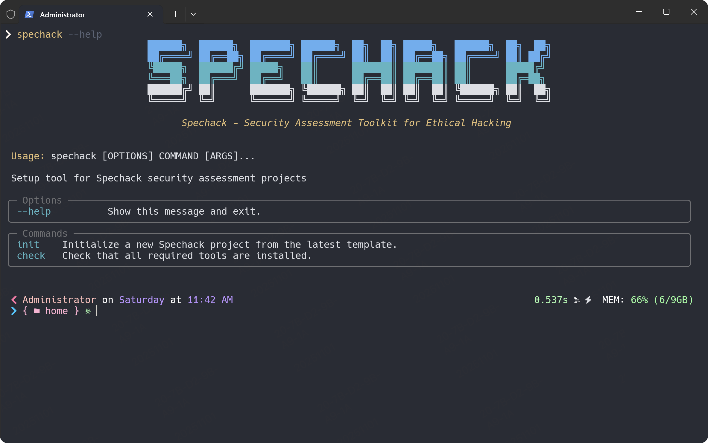

<div align="center">
    

    <h1>🔒 Spec Hack</h1>
    <h3><em>Standardize penetration testing workflows with AI automation.</em></h3>
    
</div>



<p align="center">
    <strong>An open source framework that enables security professionals to standardize penetration testing processes and leverage AI for automated security assessments, ensuring consistent and thorough testing methodologies.</strong>
</p>


<p align="center">
    <a href="./README-zh.md">中文</a> | <a href="./README.md">English</a>
</p>

---

## Table of Contents

- [🤔 What is Security Assessment-Driven Development?](#-what-is-security-assessment-driven-development)
- [⚡ Get Started](#-get-started)
- [📽️ Video Overview](#️-video-overview)
- [🤖 Supported AI Agents](#-supported-ai-agents)
- [🔧 Spechack CLI Reference](#-spechack-cli-reference)
- [📚 Core Philosophy](#-core-philosophy)
- [🌟 Development Phases](#-development-phases)
- [🎯 Experimental Goals](#-experimental-goals)
- [🔧 Prerequisites](#-prerequisites)
- [📖 Learn More](#-learn-more)
- [📋 Detailed Process](#-detailed-process)
- [🔍 Troubleshooting](#-troubleshooting)
- [👥 Maintainers](#-maintainers)
- [💬 Support](#-support)
- [🙏 Acknowledgements](#-acknowledgements)
- [📄 License](#-license)

## 🤔 What is Security Assessment-Driven Development?

Security Assessment-Driven Development **transforms** how penetration testing is conducted. Traditionally, security assessments relied on ad-hoc approaches and manual processes that varied between testers and engagements. Security Assessment-Driven Development changes this: **specifications become executable workflows**, standardizing testing methodologies and leveraging AI to automate security assessments.

This approach is specifically designed for penetration testers, security researchers, and red team professionals who need to ensure consistent, thorough, and efficient security assessments across different engagements while maintaining high-quality testing standards.

## ⚡ Get Started

### 1. Install Spec Hack CLI

Choose your preferred installation method:

#### Option 1: Persistent Installation (Recommended)

Install once and use everywhere:

```bash
uv tool install spechack --from git+https://github.com/arch3rPro/spec-hack.git
```

Then use the tool directly:

```bash
spechack init <PROJECT_NAME>
spechack check
```

To upgrade spechack run:

```bash
uv tool install spechack --force --from git+https://github.com/arch3rPro/spec-hack.git
```

#### Option 2: One-time Usage

Run directly without installing:

```bash
uvx --from git+https://github.com/arch3rPro/spec-hack.git spechack init <PROJECT_NAME>
```

**Benefits of persistent installation:**

- Tool stays installed and available in PATH
- No need to create shell aliases
- Better tool management with `uv tool list`, `uv tool upgrade`, `uv tool uninstall`
- Cleaner shell configuration

### 2. Establish project principles

Launch your AI assistant in the project directory. The `/spechack.*` commands are available in the assistant.

Use the **`/spechack.constitution`** command to create your project's governing principles and development guidelines that will guide all subsequent development.

```bash
/spechack.constitution Create principles focused on security assessment methodology, testing standards, reporting consistency, and ethical hacking requirements
```

### 3. Create the spec

Use the **`/spechack.spec`** command to describe what you want to assess. Focus on the **what** and **why**, not the specific tools.

```bash
/spechack.spec Conduct a security assessment of an e-commerce platform focusing on authentication mechanisms, payment processing security, and data protection measures. The assessment should identify vulnerabilities in user authentication, session management, and secure payment processing.
```

### 4. Create a technical implementation plan

Use the **`/spechack.plan`** command to provide your security tools and methodology choices.

```bash
/spechack.plan The assessment uses OWASP testing methodology with tools like Burp Suite, OWASP ZAP, and custom scripts. Focus on automated scanning for common vulnerabilities followed by manual testing of business logic flaws. All findings are documented in a structured report format.
```

### 5. Break down into tasks

Use **`/spechack.tasks`** to create an actionable task list from your implementation plan.

```bash
/spechack.tasks
```

### 6. Execute implementation

Use **`/spechack.execute`** to execute all tasks and perform your security assessment according to the plan.

```bash
/spechack.execute
```

For detailed step-by-step instructions, see our [comprehensive guide](./spec-driven.md).

## 🚀 How it Works

### 1. Constitution (🏛️)
Define your security assessment framework, methodologies, and tools. This establishes the foundation for your penetration testing approach.

### 2. Specification (📋)
Create detailed security specifications that describe what vulnerabilities to test, what techniques to use, and what success criteria look like.

### 3. Planning (📐)
Generate a comprehensive security assessment plan with specific test cases, attack vectors, and defensive measures to evaluate.

### 4. Task Breakdown (📝)
Automatically break down your security assessment plan into actionable tasks with clear dependencies and priorities.

### 5. Implementation (⚙️)
Execute your security assessment tasks with automated tooling, manual testing, and detailed reporting.

### 6. Verification (✅)
Validate your findings, ensure comprehensive coverage, and generate professional security assessment reports.


## 🤖 Supported AI Agents

| Agent                                                     | Support | Notes                                             |
|-----------------------------------------------------------|---------|---------------------------------------------------|
| [Claude Code](https://www.anthropic.com/claude-code)      | ✅ |                                                   |
| [GitHub Copilot](https://code.visualstudio.com/)          | ✅ |                                                   |
| [Gemini CLI](https://github.com/google-gemini/gemini-cli) | ✅ |                                                   |
| [Cursor](https://cursor.sh/)                              | ✅ |                                                   |
| [Qwen Code](https://github.com/QwenLM/qwen-code)          | ✅ |                                                   |
| [opencode](https://opencode.ai/)                          | ✅ |                                                   |
| [Windsurf](https://windsurf.com/)                         | ✅ |                                                   |
| [Kilo Code](https://github.com/Kilo-Org/kilocode)         | ✅ |                                                   |
| [Auggie CLI](https://docs.augmentcode.com/cli/overview)   | ✅ |                                                   |
| [CodeBuddy CLI](https://www.codebuddy.ai/cli)             | ✅ |                                                   |
| [Roo Code](https://roocode.com/)                          | ✅ |                                                   |
| [Codex CLI](https://github.com/openai/codex)              | ✅ |                                                   |
| [Amazon Q Developer CLI](https://aws.amazon.com/developer/learning/q-developer-cli/) | ⚠️ | Amazon Q Developer CLI [does not support](https://github.com/aws/amazon-q-developer-cli/issues/3064) custom arguments for slash commands. |
| [Amp](https://ampcode.com/) | ✅ | |

## 🔧 Spechack CLI Reference

The `spechack` command supports the following options:

### Commands

| Command     | Description                                                    |
|-------------|----------------------------------------------------------------|
| `init`      | Initialize a new Spechack project from the latest template      |
| `check`     | Check for installed tools (`git`, `claude`, `gemini`, `code`/`code-insiders`, `cursor-agent`, `windsurf`, `qwen`, `opencode`, `codex`) |

### `spechack init` Arguments & Options

| Argument/Option        | Type     | Description                                                                  |
|------------------------|----------|------------------------------------------------------------------------------|
| `<project-name>`       | Argument | Name for your new project directory (optional if using `--here`, or use `.` for current directory) |
| `--ai`                 | Option   | AI assistant to use: `claude`, `gemini`, `copilot`, `cursor-agent`, `qwen`, `opencode`, `codex`, `windsurf`, `kilocode`, `auggie`, `roo`, `codebuddy`, `amp`, or `q` |
| `--script`             | Option   | Script variant to use: `sh` (bash/zsh) or `ps` (PowerShell)                 |
| `--ignore-agent-tools` | Flag     | Skip checks for AI agent tools like Claude Code                             |
| `--no-git`             | Flag     | Skip git repository initialization                                          |
| `--here`               | Flag     | Initialize project in the current directory instead of creating a new one   |
| `--force`              | Flag     | Force merge/overwrite when initializing in current directory (skip confirmation) |
| `--skip-tls`           | Flag     | Skip SSL/TLS verification (not recommended)                                 |
| `--debug`              | Flag     | Enable detailed debug output for troubleshooting                            |
| `--github-token`       | Option   | GitHub token for API requests (or set GH_TOKEN/GITHUB_TOKEN env variable)  |

### Examples

```bash
# Basic project initialization
spechack init my-project

# Initialize with specific AI assistant
spechack init my-project --ai claude

# Initialize with Cursor support
spechack init my-project --ai cursor-agent

# Initialize with Windsurf support
spechack init my-project --ai windsurf

# Initialize with Amp support
spechack init my-project --ai amp

# Initialize with PowerShell scripts (Windows/cross-platform)
spechack init my-project --ai copilot --script ps

# Initialize in current directory
spechack init . --ai copilot
# or use the --here flag
spechack init --here --ai copilot

# Force merge into current (non-empty) directory without confirmation
spechack init . --force --ai copilot
# or 
spechack init --here --force --ai copilot

# Skip git initialization
spechack init my-project --ai gemini --no-git

# Enable debug output for troubleshooting
spechack init my-project --ai claude --debug

# Use GitHub token for API requests (helpful for corporate environments)
spechack init my-project --ai claude --github-token ghp_your_token_here

# Check system requirements
spechack check
```

### Available Slash Commands

After running `spechack init`, your AI coding agent will have access to these slash commands for structured security assessment:

#### Core Commands

Essential commands for the Security Assessment workflow:

| Command                  | Description                                                           |
|--------------------------|-----------------------------------------------------------------------|
| `/spechack.constitution`  | Create or update security assessment principles and guidelines       |
| `/spechack.spec`       | Define what you want to assess (security requirements and scope)      |
| `/spechack.plan`          | Create security assessment plans with your chosen tools and methodology |
| `/spechack.tasks`         | Generate actionable task lists for security assessment               |
| `/spechack.execute`       | Execute all security assessment tasks according to the plan         |

#### Optional Commands

Additional commands for enhanced quality and validation:

| Command              | Description                                                           |
|----------------------|-----------------------------------------------------------------------|
| `/spechack.clarify`   | Clarify underspecified areas (recommended before `/spechack.plan`)     |
| `/spechack.analyze`   | Cross-artifact consistency & coverage analysis (run after `/spechack.tasks`, before `/spechack.execute`) |
| `/spechack.checklist` | Generate custom security checklists that validate assessment completeness, thoroughness, and methodology consistency |

### Environment Variables

| Variable         | Description                                                                                    |
|------------------|------------------------------------------------------------------------------------------------|
| `SPECHACK_FEATURE` | Override feature detection for non-Git repositories. Set to the feature directory name (e.g., `001-web-app-pentest`) to work on a specific assessment when not using Git branches.<br/>**Must be set in the context of the agent you're working with prior to using `/spechack.plan` or follow-up commands. |

## 📚 Core Philosophy

Security-Driven Assessment is a structured process that emphasizes:

- **Intent-driven assessment** where specifications define the "*what*" and "*why*" before the "*how*"
- **Rich security specification creation** using established methodologies and ethical guidelines
- **Multi-step refinement** rather than one-shot security testing from basic prompts
- **Heavy reliance** on advanced AI model capabilities for security assessment interpretation

## 🌟 Assessment Phases

| Phase | Focus | Key Activities |
|-------|-------|----------------|
| **Initial Assessment** ("Greenfield") | Comprehensive security evaluation | <ul><li>Define assessment scope and objectives</li><li>Generate security specifications</li><li>Plan assessment methodology</li><li>Execute thorough security testing</li></ul> |
| **Targeted Testing** | Specific vulnerability exploration | <ul><li>Explore diverse attack vectors</li><li>Support multiple security tools & techniques</li><li>Experiment with different assessment approaches</li></ul> |
| **Follow-up Assessments** ("Brownfield") | Re-assessment after remediation | <ul><li>Verify vulnerability fixes</li><li>Test for new attack surfaces</li><li>Adapt assessment methodologies</li></ul> |

## 🎯 Assessment Goals

Our security assessment methodology focuses on:

### Methodology independence

- Conduct assessments using diverse security frameworks
- Validate the hypothesis that Security-Driven Assessment is a process not tied to specific tools, techniques, or platforms

### Organizational constraints

- Demonstrate mission-critical security assessment
- Incorporate organizational constraints (compliance requirements, industry standards, security policies)
- Support enterprise security frameworks and regulatory requirements

### Target-centric assessment

- Conduct assessments for different system types and security requirements
- Support various assessment approaches (from automated scanning to manual penetration testing)

### Comprehensive & iterative processes

- Validate the concept of thorough security assessment exploration
- Provide robust iterative security assessment workflows
- Extend processes to handle re-assessments and continuous security monitoring

## 🔧 Prerequisites

- **Linux/macOS/Windows**
- [Supported](#-supported-ai-agents) AI coding agent.
- [uv](https://docs.astral.sh/uv/) for package management
- [Python 3.11+](https://www.python.org/downloads/)
- [Git](https://git-scm.com/downloads)
- Security assessment tools (recommended):
  - [Nmap](https://nmap.org/) for network discovery and security auditing
  - [OWASP ZAP](https://www.zaproxy.org/) for web application security testing
  - [Burp Suite](https://portswigger.net/burp) for web application security testing
  - [Metasploit Framework](https://www.metasploit.com/) for penetration testing

If you encounter issues with an agent, please open an issue so we can refine the integration.

## 📖 Learn More

- **[Complete Security Assessment Methodology](./spec-driven.md)** - Deep dive into the full process
- **[Detailed Walkthrough](#-detailed-process)** - Step-by-step assessment guide

---

## 📋 Detailed Process

<details>
<summary>Click to expand the detailed step-by-step walkthrough</summary>

You can use the Spechack CLI to bootstrap your project, which will bring in the required artifacts in your environment. Run:

```bash
spechack init <project_name>
```

Or initialize in the current directory:

```bash
spechack init .
# or use the --here flag
spechack init --here
# Skip confirmation when the directory already has files
spechack init . --force
# or
spechack init --here --force
```

<!-- Spechack CLI bootstrapping a new project in the terminal -->
<!-- Note: spechack_cli.gif does not exist, consider adding this image or removing the reference -->

You will be prompted to select the AI agent you are using. You can also proactively specify it directly in the terminal:

```bash
spechack init <project_name> --ai claude
spechack init <project_name> --ai gemini
spechack init <project_name> --ai copilot

# Or in current directory:
spechack init . --ai claude
spechack init . --ai codex

# or use --here flag
spechack init --here --ai claude
spechack init --here --ai codex

# Force merge into a non-empty current directory
spechack init . --force --ai claude

# or
spechack init --here --force --ai claude
```

The CLI will check if you have Claude Code, Gemini CLI, Cursor CLI, Qwen CLI, opencode, Codex CLI, or Amazon Q Developer CLI installed. If you do not, or you prefer to get the templates without checking for the right tools, use `--ignore-agent-tools` with your command:

```bash
spechack init <project_name> --ai claude --ignore-agent-tools
```

### **STEP 1:** Establish project principles

Go to the project folder and run your AI agent. In our example, we're using `claude`.

<!-- Bootstrapping Claude Code environment -->
<!-- Note: bootstrap-claude-code.gif does not exist, consider adding this image or removing the reference -->

You will know that things are configured correctly if you see the `/spechack.constitution`, `/spechack.spec`, `/spechack.plan`, `/spechack.tasks`, and `/spechack.execute` commands available.

The first step should be establishing your security assessment principles using the `/spechack.constitution` command. This helps ensure consistent decision-making throughout all subsequent assessment phases:

```text
/spechack.constitution Create principles focused on security assessment methodology, testing standards, reporting consistency, and ethical hacking requirements. Include governance for how these principles should guide assessment decisions and testing choices.
```

This step creates or updates the `.spechack/memory/constitution.md` file with your project's foundational guidelines that the AI agent will reference during specification, planning, and execution phases.

### **STEP 2:** Create security assessment specifications

With your assessment principles established, you can now create the security specifications. Use the `/spechack.spec` command and then provide the concrete requirements for the security assessment you want to conduct.

>[!IMPORTANT]
>Be as explicit as possible about *what* you are trying to assess and *why*. **Do not focus on specific security tools at this point**.

An example prompt:

```text
Conduct a comprehensive security assessment of an e-commerce platform. Focus on authentication mechanisms, session management, payment processing security, and data protection measures. The assessment should identify vulnerabilities in user authentication, session handling, secure payment processing, and data encryption. Include testing for OWASP Top 10 vulnerabilities, with particular attention to injection flaws, broken authentication, sensitive data exposure, and security misconfigurations. The assessment should cover both the web application and its underlying infrastructure, including API endpoints, database security, and network configurations.
```

After this prompt is entered, you should see Claude Code kick off the planning and spec drafting process. Claude Code will also trigger some of the built-in scripts to set up the repository.

Once this step is completed, you should have a new branch created (e.g., `001-create-taskify`), as well as a new specification in the `specs/001-create-taskify` directory.

The produced specification should contain a set of user stories and functional requirements, as defined in the template.

At this stage, your project folder contents should resemble the following:

```text
└── .spechack
    ├── memory
    │  └── constitution.md
    ├── scripts
    │  ├── check-prerequisites.sh
    │  ├── common.sh
    │  ├── create-new-feature.sh
    │  ├── setup-plan.sh
    │  └── update-claude-md.sh
    ├── specs
    │  └── 001-create-taskify
    │      └── spec.md
    └── templates
        ├── plan-template.md
        ├── spec-template.md
        └── tasks-template.md
```

### **STEP 3:** Security assessment clarification (required before planning)

With the baseline specification created, you can go ahead and clarify any of the requirements that were not captured properly within the first shot attempt.

You should run the structured clarification workflow **before** creating a technical plan to reduce rework downstream.

Preferred order:

1. Use `/spechack.clarify` (structured) – sequential, coverage-based questioning that records answers in a Clarifications section.
2. Optionally follow up with ad-hoc free-form refinement if something still feels vague.

If you intentionally want to skip clarification (e.g., initial reconnaissance), explicitly state that so the agent doesn't block on missing clarifications.

Example free-form refinement prompt (after `/spechack.clarify` if still needed):

```text
For each security assessment area, specify the testing methods to be used. For authentication testing, include both automated and manual testing approaches. For network security assessment, include both internal and external network penetration testing approaches. Ensure that each assessment area has at least three specific testing techniques defined.
```

You should also ask Claude Code to validate the **Assessment Scope Checklist**, checking off the items that are covered by the assessment scope, and leave the ones that are not covered unchecked. The following prompt can be used:

```text
Read the assessment scope checklist, and check off each item in the checklist if the security assessment covers that area. Leave it empty if it does not.
```

It's important to use the interaction with Claude Code as an opportunity to clarify and ask questions around the specification - **do not treat its first attempt as final**.

### **STEP 4:** Generate a security assessment plan

You can now be specific about the security assessment methodology and tools. You can use the `/spechack.plan` command that is built into the project template with a prompt like this:

```text
We will conduct this security assessment using OWASP methodology with Nmap for network discovery, OWASP ZAP for web application security testing, and Burp Suite for in-depth web application analysis. The assessment will include automated vulnerability scanning, manual penetration testing, and security code review. We'll use Metasploit Framework for exploitation testing and create detailed reports with remediation recommendations.
```

The output of this step will include a number of implementation detail documents, with your directory tree resembling this:

```text
.
├── CLAUDE.md
├── memory
│  └── constitution.md
├── scripts
│  ├── check-prerequisites.sh
│  ├── common.sh
│  ├── create-new-feature.sh
│  ├── setup-plan.sh
│  └── update-claude-md.sh
├── specs
│  └── 001-create-taskify
│      ├── contracts
│      │  ├── api-spec.json
│      │  └── signalr-spec.md
│      ├── data-model.md
│      ├── plan.md
│      ├── quickstart.md
│      ├── research.md
│      └── spec.md
└── templates
    ├── CLAUDE-template.md
    ├── plan-template.md
    ├── spec-template.md
    └── tasks-template.md
```

Check the `research.md` document to ensure that the right security assessment methodology is used, based on your instructions. You can ask Claude Code to refine it if any of the security tools stand out, or even have it check the locally-installed version of the security tools you want to use (e.g., Nmap, OWASP ZAP).

Additionally, you might want to ask Claude Code to research details about the chosen security tools if they're something that is rapidly changing (e.g., new vulnerability techniques, updated testing methodologies), with a prompt like this:

```text
I want you to go through the security assessment plan and implementation details, looking for areas that could
benefit from additional research as security tools and techniques are rapidly evolving. For those areas that you identify that
require further research, I want you to update the research document with additional details about the specific
versions and techniques that we are going to be using in this security assessment and spawn parallel research tasks to clarify
any details using research from the web.
```

During this process, you might find that Claude Code gets stuck researching the wrong thing - you can help nudge it in the right direction with a prompt like this:

```text
I think we need to break this down into a series of steps. First, identify a list of security assessment tasks
that you would need to do during the assessment that you're not sure of or would benefit
from further research. Write down a list of those tasks. And then for each one of these tasks,
I want you to spin up a separate research task so that the net results is we are researching
all of those very specific tasks in parallel. What I saw you doing was it looks like you were
researching security tools in general and I don't think that's gonna do much for us in this case.
That's way too untargeted research. The research needs to help you solve a specific targeted security question.
```

>[!NOTE]
>Claude Code might be over-eager and add security tools or techniques that you did not ask for. Ask it to clarify the rationale and the source of the change.

### **STEP 5:** Have Claude Code validate the assessment plan

With the plan in place, you should have Claude Code run through it to make sure that there are no missing pieces. You can use a prompt like this:

```text
Now I want you to go and audit the security assessment plan and the assessment detail files.
Read through it with an eye on determining whether or not there is a sequence of security assessment tasks that you need
to be doing that are obvious from reading this. Because I don't know if there's enough here. For example,
when I look at the core assessment methodology, it would be useful to reference the appropriate places in the assessment
details where it can find the information as it walks through each step in the core assessment or in the refinement.
```

This helps refine the security assessment plan and helps you avoid potential blind spots that Claude Code missed in its planning cycle. Once the initial refinement pass is complete, ask Claude Code to go through the checklist once more before you can start the assessment.

You can also ask Claude Code (if you have the [GitHub CLI](https://docs.github.com/en/github-cli/github-cli) installed) to go ahead and create a pull request from your current branch to `main` with a detailed description, to make sure that the effort is properly tracked.

>[!NOTE]
>Before you have the agent execute the assessment, it's also worth prompting Claude Code to cross-check the details to see if there are any over-engineered assessment techniques (remember - it can be over-eager). If over-engineered techniques exist, you can ask Claude Code to resolve them. Ensure that Claude Code follows the [constitution](./memory/constitution.md) as the foundational piece that it must adhere to when establishing the plan.

### **STEP 6:** Generate task breakdown with /spechack.tasks

With the assessment plan validated, you can now break down the plan into specific, actionable tasks that can be executed in the correct order. Use the `/spechack.tasks` command to automatically generate a detailed task breakdown from your assessment plan:

```text
/spechack.tasks
```

This step creates a `tasks.md` file in your security assessment specification directory that contains:

- **Task breakdown organized by security domain** - Each security domain becomes a separate assessment phase with its own set of tasks
- **Dependency management** - Tasks are ordered to respect dependencies between assessment areas (e.g., reconnaissance before exploitation)
- **Parallel execution markers** - Tasks that can run in parallel are marked with `[P]` to optimize assessment workflow
- **Tool specifications** - Each task includes the specific security tools and techniques to be used
- **Evidence collection structure** - Tasks include requirements for evidence collection and documentation
- **Checkpoint validation** - Each security domain phase includes checkpoints to validate assessment coverage

The generated tasks.md provides a clear roadmap for the `/spechack.execute` command, ensuring systematic assessment that maintains security standards and allows for comprehensive coverage of all security domains.

### **STEP 7:** Execute security assessment

Once ready, use the `/spechack.execute` command to execute your security assessment plan:

```text
/spechack.execute
```

The `/spechack.execute` command will:

- Validate that all prerequisites are in place (constitution, spec, plan, and tasks)
- Parse the task breakdown from `tasks.md`
- Execute tasks in the correct order, respecting dependencies and parallel execution markers
- Follow the security methodology defined in your assessment plan
- Provide progress updates and handle errors appropriately

>[!IMPORTANT]
>The AI agent will execute local CLI commands (such as `nmap`, `zap`, `burpsuite`, etc.) - make sure you have the required security tools installed on your machine.

Once the assessment is complete, review the findings and resolve any issues that may have been missed during the automated assessment. You can copy and paste such issues back to your AI agent for further analysis.

</details>

---

## 🔍 Troubleshooting

### Git Credential Manager on Linux

If you're having issues with Git authentication on Linux, you can install Git Credential Manager:

```bash
#!/usr/bin/env bash
set -e
echo "Downloading Git Credential Manager v2.6.1..."
wget https://github.com/git-ecosystem/git-credential-manager/releases/download/v2.6.1/gcm-linux_amd64.2.6.1.deb
echo "Installing Git Credential Manager..."
sudo dpkg -i gcm-linux_amd64.2.6.1.deb
echo "Configuring Git to use GCM..."
git config --global credential.helper manager
echo "Cleaning up..."
rm gcm-linux_amd64.2.6.1.deb
```

## 👥 Maintainers

- arch3rPro ([@arch3rPro](https://github.com/arch3rPro))

## 💬 Support

For support, please open a [GitHub issue](https://github.com/arch3rPro/spec-hack/issues/new). We welcome bug reports, feature requests, and questions about using Security Assessment methodology.


## 📄 License

This project is licensed under the terms of the MIT open source license. Please refer to the [LICENSE](./LICENSE) file for the full terms.
